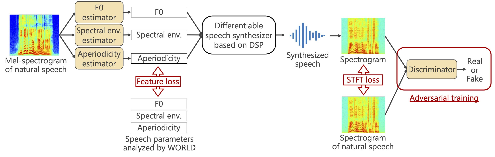

# Speech Parameter Estimation Using Differentiable Speech Synthesizer

## About this repository

We implement a differentiable speech analysis-synthesis system (see figure below), which consists of a speech parameter estimator and a differentiable speech synthesizer. We can train a speech parameter estimator (Deep Neural Network: DNN) to ensure that the re-synthesized speech from the estimated parameters gets closer to natural speech. This repository contains an implementation of **Differentiable Speech Synthesizer** and a training code of a speech parameter estimation model using the synthesizer.



## Create virtual environment

- Recommend ```Python 3.8.0```.
- Install python packages:

  ```bash
  $ pip install -r requirements.txt
  ```

## 1. Differentiable Speech Synthesizer (DSS)

Vocoder synthesis part of signal processing implemented in PyTorch.

### How to use DSS

The following is a sample code to synthesize waveforms in DSS using analysis parameters by WORLD.

```python
from dss import DifferentiableSpeechSynthesizer, audio

# World Parameter
f0, vuv, sp, ap = audio.world_analysis(
    waveform=waveform,  # tensor
    fs=24000,           # samples
    n_fft=1024,         # samples
    frame_period=5,     # msec
    harvest=True,
)

# DSS Instance
synthesizer = DifferentiableSpeechSynthesizer(
    device="cpu",
    sample_rate=24000,   # samples
    n_fft=1024,          # samples
    hop_length=120,      # samples (5 msec)
    synth_hop_length=24, # samples (1 msec)
)

# NOTE: When using the synthesis process by DSS, determine the lower limit
# of F0 or convert to continuous F0. If F0 = 0[Hz], it will not work well.
f0 = torch.clamp(input=f0, min=71.0)

# Synth by DSS
dss_wav = synthesizer(f0_hz=f0, spectral_env=sp, aperiodicity=ap)

```

### About test_anasyn.py

This is a script that generates the results of the analysis-synthesis; we recommend that you check the source code as it is an example of how to use DSS.

#### Example script

```bash
python test_anasyn.py \
  --input_data_dir INPUT_WAV_DIR_PATH \
  --output_data_dir OUTPUT_WAV_DIR_PATH
```

- The speech analysis synthesis results of the wav files in `INPUT_WAV_DIR_PATH` are output to `OUTPUT_WAV_DIR_PATH`.
- `World` is used for speech analysis to estimate F0, spectral envelope, and aperiodicity indices.
- Two types of synthesis results are generated: one by `World` and the other by `DSS`.
 - `*_world.wav` : Synthesis result by `World (Harvest)`
 - `*_dss.wav` : Synthesis result by `DSS`

## 2. Training of speech parameter estimation model

### Prepare [ParallelWaveGAN](https://github.com/kan-bayashi/ParallelWaveGAN):

```bash
$ git clone https://github.com/kan-bayashi/ParallelWaveGAN.git
$ cd ParallelWaveGAN
$ pip install -e .
```

### Download dataset

Download [jvs_ver1.zip](https://drive.google.com/file/d/19oAw8wWn3Y7z6CKChRdAyGOB9yupL_Xt/view) into ```./download/```, and unzip the file.

### Preprocessing

Edit ```conf/config.yaml``` and run the script:

```bash
$ python preprocess.py
```

### Training

Edit ```conf/config.yaml``` and run the script:

```bash
$ python train.py
```

## LICENSE

- Apache 2.0 license ([LICENSE](LICENSE))

## Collaborators

- [Yuta Matsunaga](https://sites.google.com/g.ecc.u-tokyo.ac.jp/yuta-matsunaga/home) (The University of Tokyo)
- [Ryo Terashima](https://github.com/RyoJerky)

## Citation

```
@inproceedings{Matsunaga:ASJ2022A-2,
  author = {松永 裕太 and 寺島 涼 and 橘 健太郎},
  title = {微分可能な信号処理に基づく音声合成器を用いた DNN 音声パラメータ推定の検討},
  booktitle = {日本音響学会第148回(2022年秋季)研究発表会},
  month = {Sep.},
  year = {2022},
}

@inproceedings{Matsunaga:ASJ2022A-2,
  author = {Yuta Matsunaga and Ryo Terashima and Kentaro Tachibana},
  title = {A study of DNN-based speech parameter estimation with speech synthesizer based on differentiable digital signal processing},
  booktitle = {Acoustical Society of Japan 2022 Autumn Meeting},
  month = {Sep.},
  year = {2022},
  note = {in Japanese},
}
```

## References

- [Scyclone-PyTorch](https://github.com/tarepan/Scyclone-PyTorch)
- [ParallelWaveGAN](https://github.com/kan-bayashi/ParallelWaveGAN)
- [JVS corpus](https://sites.google.com/site/shinnosuketakamichi/research-topics/jvs_corpus)
